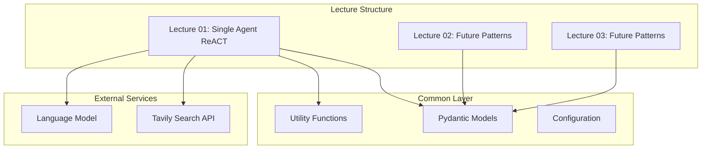

# Design Document

## Overview

The Agentic Stock Analyzer is a demo repository showcasing different agentic communication patterns through a practical stock analysis system. The system demonstrates how AI agents can research stocks and provide investment advice using various communication patterns, starting with a simple ReACT (Reasoning and Acting) loop.

The architecture is designed to be educational, modular, and extensible, allowing for easy addition of new communication patterns in subsequent lectures while maintaining a clean separation of concerns.

## Architecture

### High-Level Architecture



### Project Structure

```
agentic-stock-analyzer/
├── common/
│   ├── __init__.py
│   ├── models.py          # Pydantic models for data validation
│   ├── config.py          # Configuration management
│   └── utils.py           # Shared utility functions
├── lecture01/
│   ├── __init__.py
│   ├── main.py            # Single agent ReACT implementation
│   └── agent.py           # Agent definition and tools
├── lecture02/             # Future: Multi-agent patterns
├── lecture03/             # Future: Advanced patterns
├── .env                   # Environment variables (API keys)
├── pyproject.toml         # UV project configuration
├── README.md              # Project documentation
└── requirements.txt       # Dependencies
```

## Components and Interfaces

### Core Components

#### 1. Stock Analysis Agent (Lecture 01)
- **Purpose**: Single agent implementing ReACT pattern for stock analysis
- **Framework**: Pydantic-AI with OpenAI/Anthropic models
- **Pattern**: ReACT (Reasoning and Acting) loop
- **Tools**: Tavily search integration for financial research

#### 2. Research Tool
- **Purpose**: Interface to Tavily API for financial information gathering
- **Functionality**: 
  - Company information lookup
  - Recent news and market sentiment
  - Financial metrics and performance data
  - Industry analysis and comparisons

#### 3. Report Generation
- **Purpose**: Structured output generation for investment analysis
- **Format**: Pydantic models ensuring consistent report structure
- **Content**: Company analysis, risk assessment, investment recommendation

### Interface Definitions

#### Agent Interface
```python
class StockAnalysisAgent:
    def analyze_stock(self, symbol: str) -> StockReport
    def analyze_portfolio(self, symbols: List[str]) -> List[StockReport]
```

#### Research Tool Interface
```python
class TavilyResearchTool:
    def search_company_info(self, symbol: str) -> CompanyInfo
    def search_recent_news(self, symbol: str) -> List[NewsItem]
    def search_financial_metrics(self, symbol: str) -> FinancialMetrics
```

## Data Models

### Core Data Models

#### Stock Information
```python
class StockSymbol(BaseModel):
    symbol: str = Field(..., description="Stock ticker symbol")
    exchange: Optional[str] = Field(None, description="Stock exchange")

class CompanyInfo(BaseModel):
    name: str
    symbol: str
    sector: str
    industry: str
    market_cap: Optional[float]
    description: str

class FinancialMetrics(BaseModel):
    current_price: Optional[float]
    price_change: Optional[float]
    price_change_percent: Optional[float]
    volume: Optional[int]
    pe_ratio: Optional[float]
    dividend_yield: Optional[float]
```

#### News and Sentiment
```python
class NewsItem(BaseModel):
    title: str
    summary: str
    url: str
    published_date: datetime
    sentiment: Optional[str] = Field(None, description="positive/negative/neutral")

class MarketSentiment(BaseModel):
    overall_sentiment: str
    confidence_score: float
    key_factors: List[str]
```

#### Investment Analysis
```python
class RiskAssessment(BaseModel):
    risk_level: str = Field(..., description="low/medium/high")
    risk_factors: List[str]
    volatility_assessment: str

class InvestmentRecommendation(BaseModel):
    recommendation: str = Field(..., description="buy/hold/sell")
    confidence: float = Field(..., ge=0, le=1)
    reasoning: str
    target_price: Optional[float]
    time_horizon: str

class StockReport(BaseModel):
    symbol: str
    company_info: CompanyInfo
    financial_metrics: FinancialMetrics
    recent_news: List[NewsItem]
    market_sentiment: MarketSentiment
    risk_assessment: RiskAssessment
    investment_recommendation: InvestmentRecommendation
    analysis_timestamp: datetime
```

### Configuration Models
```python
class TavilyConfig(BaseModel):
    api_key: str
    max_results: int = 10
    search_depth: str = "advanced"

class AgentConfig(BaseModel):
    model_name: str = "openai:gpt-4o"
    temperature: float = 0.1
    max_retries: int = 3

class AppConfig(BaseModel):
    tavily: TavilyConfig
    agent: AgentConfig
    debug: bool = False
```

## Error Handling

### Error Categories

#### 1. API Errors
- **Tavily API failures**: Network issues, rate limits, invalid API keys
- **LLM API failures**: Model unavailability, token limits, authentication
- **Handling**: Graceful degradation with fallback strategies

#### 2. Data Validation Errors
- **Invalid stock symbols**: Non-existent or delisted stocks
- **Malformed responses**: Incomplete or corrupted API responses
- **Handling**: Pydantic validation with clear error messages

#### 3. Business Logic Errors
- **Insufficient data**: Unable to gather enough information for analysis
- **Analysis failures**: Agent unable to generate coherent recommendations
- **Handling**: Partial results with confidence indicators

### Error Handling Strategy

```python
class StockAnalysisError(Exception):
    """Base exception for stock analysis errors"""
    pass

class InsufficientDataError(StockAnalysisError):
    """Raised when insufficient data is available for analysis"""
    pass

class APIError(StockAnalysisError):
    """Raised when external API calls fail"""
    pass

# Error handling in agent tools
@agent.tool
async def research_stock(ctx: RunContext[Dependencies], symbol: str) -> str:
    try:
        # Attempt research
        return await ctx.deps.tavily_client.search_company_info(symbol)
    except APIError as e:
        # Graceful degradation
        return f"Limited information available for {symbol}: {str(e)}"
    except Exception as e:
        # Log and continue with partial data
        logger.warning(f"Research failed for {symbol}: {str(e)}")
        return f"Unable to research {symbol} - proceeding with available data"
```

## Testing Strategy

### Testing Approach

#### 1. Unit Testing
- **Pydantic Models**: Validation logic and serialization
- **Utility Functions**: Data processing and formatting
- **Configuration**: Environment variable loading and validation

#### 2. Integration Testing
- **Tavily API Integration**: Mock API responses for consistent testing
- **Agent Tool Testing**: Verify tool registration and execution
- **End-to-End Flows**: Complete stock analysis workflows

#### 3. Agent Testing
- **ReACT Pattern Testing**: Verify reasoning and action loops
- **Tool Usage Testing**: Ensure proper tool selection and execution
- **Output Validation**: Structured response generation

### Test Structure

```python
# Unit tests for models
class TestStockModels:
    def test_stock_symbol_validation(self):
        # Test valid and invalid stock symbols
        pass
    
    def test_financial_metrics_serialization(self):
        # Test data serialization/deserialization
        pass

# Integration tests for tools
class TestTavilyIntegration:
    @pytest.fixture
    def mock_tavily_client(self):
        # Mock Tavily API responses
        pass
    
    def test_company_research(self, mock_tavily_client):
        # Test company information retrieval
        pass

# Agent behavior tests
class TestStockAnalysisAgent:
    def test_single_stock_analysis(self):
        # Test complete analysis workflow
        pass
    
    def test_error_handling(self):
        # Test graceful error handling
        pass
```

### Mock Data Strategy

#### Test Data Sets
- **Sample Stock Data**: Realistic financial metrics and company information
- **News Articles**: Varied sentiment and content for testing
- **API Responses**: Comprehensive mock responses for different scenarios

#### Testing Environment
- **Isolated Testing**: No external API calls during unit tests
- **Integration Testing**: Controlled API interactions with test keys
- **Performance Testing**: Response time and resource usage validation

## Implementation Notes

### Technology Choices

#### Pydantic-AI Framework
- **Rationale**: Modern Python AI framework with excellent type safety
- **Benefits**: FastAPI-like developer experience, built-in validation
- **ReACT Support**: Native support for reasoning and acting patterns

#### Tavily Search API
- **Rationale**: Specialized financial and web search capabilities
- **Benefits**: Real-time data, structured responses, high reliability
- **Integration**: Simple Python client with comprehensive documentation

#### UV Build System
- **Rationale**: Fast, modern Python package management
- **Benefits**: Faster dependency resolution, better caching
- **Python 3.12**: Latest features and performance improvements

### Development Workflow

#### 1. Environment Setup
```bash
# Initialize UV project
uv init agentic-stock-analyzer
cd agentic-stock-analyzer

# Add dependencies
uv add pydantic-ai tavily-python python-dotenv

# Development dependencies
uv add --dev pytest pytest-asyncio black isort mypy
```

#### 2. Configuration Management
- Environment variables for API keys
- Pydantic-based configuration validation
- Development vs production settings

#### 3. Extensibility Design
- Modular architecture for adding new lecture patterns
- Common utilities and models for reuse
- Clear interfaces for different communication patterns

This design provides a solid foundation for the educational demo while maintaining professional code quality and extensibility for future lectures on advanced agentic communication patterns.